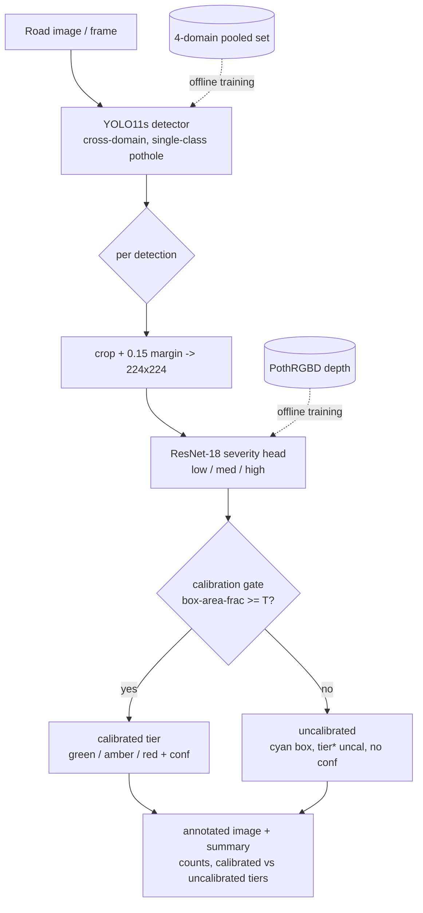

# Robust Cross-Domain Pothole Detection with Depth-Grounded, Calibration-Aware Severity

*A two-stage pipeline that detects potholes across capture domains and grades their severity — showing severity only where it is validated.*

## What it does

Give it a road image and it boxes the potholes, grades each close-range pothole **low / medium / high**, and returns a per-image count plus a severity breakdown. The detector works across very different capture conditions (dashcam/far, close-up, tiny/distant, mid-range), and severity is shown **only where it is validated** — distant/tiny potholes still get boxed and tiered, but the tier is clearly marked *uncalibrated* rather than presented as a confident grade. The result is an actionable road-inspection summary, not just bounding boxes.

## Architecture



The two stages are **decoupled**: the detector trains on the pooled 4-domain set, the severity head on PothRGBD (depth-derived labels). Neither training set is present at inference.

## Two contributions

- **Cross-domain detection** — a single YOLO11s detector trained across **4 capture domains** (far/dashcam, close-up, tiny/distant, mid), measured per-domain. It stays robust on domains where a single-dataset detector collapses (see the table).
- **Depth-grounded, calibration-aware severity** — a ResNet-18 grades severity from **depth-derived tier labels**, beats a box-area heuristic baseline, and shows tiers **only in their validated close-range regime**. Out-of-range detections are marked *uncalibrated*, never faked as confident grades.

## Headline result

Per-domain **test AP@50**, India-only baseline vs cross-domain detector (same 802-image test split, same evaluator, conf 0.20, IoU 0.5):

| domain | India-only baseline | cross-domain |
|---|---|---|
| far_dashcam | 0.551 | 0.445 |
| close_up | 0.023 | **0.919** |
| tiny_far | 0.045 | **0.539** |
| mid | 0.035 | **0.518** |
| **OVERALL** | 0.236 | **0.566** |

The baseline edges out cross-domain on **far_dashcam** — its sole training domain — an honest trade-off for the large gains everywhere else. **Full numbers, caveats, and negative results in [RESULTS.md](docs/RESULTS.md).**

## Install & run

```bash
python -m venv .venv
.venv\Scripts\python.exe -m pip install -r requirements.txt
```
Local torch is **CPU-only**; model training was done on a Colab T4 (see `notebooks/`).

**Weights are not in the repo** (gitignored). To run the pipeline/demo you need:
- `data/weights/crossdomain_best.pt` — the cross-domain detector (from the Colab run, `checkpoints/crossdomain/best.pt`).
- `data/severity/cpu_ckpts/severity_best_finetune_all.pt` — the severity head (from severity training).

Run the demo:
```bash
.venv\Scripts\python.exe app/demo.py
```
then open **http://127.0.0.1:7860**.

**Legend:** a colored box = **calibrated** severity (green = low, amber = medium, red = high); a **cyan box + `* uncal`** = severity shown but **not validated at that range** (pothole too small/distant).

## Repo layout

```
src/detection/     detector: dataset prep, eval, cross-domain build/split/eval
src/severity/      severity head: depth->tier labeling, crops, training, heuristic
src/pipeline.py    end-to-end inference (detector -> severity -> calibration gate)
app/demo.py        Gradio demo over the pipeline
configs/           frozen split manifests + data.yaml (crossdomain, rdd_india, severity_meta)
notebooks/         Colab training notebooks + setup modules
```
`data/` (datasets, crops, weights, outputs) is **gitignored** — only code + small frozen manifests are tracked.

## Datasets & credits

- **RDD2022** (Arya et al.) — multi-national road damage, CC BY.
- **PothRGBD** — RGB-D close-up potholes (Intel RealSense D415); severity depth labels.
- **Pothole Detection (Kaggle)** and **Road Damage** (Roboflow) — additional cross-domain pothole sources, CC BY.
- **Base paper:** Wu et al., *Object Detection Model Design for Tiny Road Surface Damage*, Scientific Reports 2025.

Full citations and dataset handling (dedup, licensing, splits) are in [RESULTS.md](docs/RESULTS.md) and [project.md](project.md).
