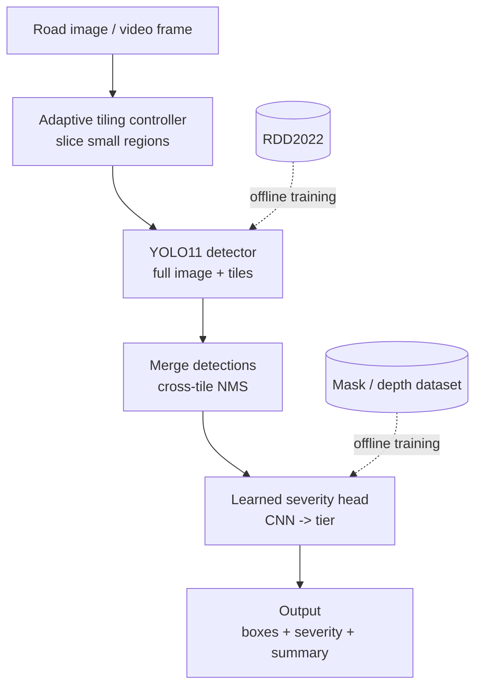

# Pothole Detection System - CV Project

## 1. Project Context

This is a final-year Computer Vision project focused on building a deep-learning-based pothole detection system. The project is intended to be developed end-to-end, starting from project/folder setup and continuing through implementation, evaluation, and deployment where feasible.

The project should be treated as a research-oriented extension of existing road-damage detection work rather than as a basic pothole-classification project.

## 2. Proposed Project Title

**Adaptive Tile-Based Real-Time Pothole Detection and Learned Severity Prediction using Deep Learning**

This is the current project title and should remain unchanged for now.

The title reflects the two main enhancements that were explicitly selected for the project:

1. **Adaptive tile-based detection** to improve detection of small/tiny or distant potholes.
2. **Learned severity prediction** to estimate pothole severity as part of the vision pipeline rather than relying only on a manual or purely heuristic post-processing step.

## 3. Core Project Objective

Build a computer-vision system that can:

- detect potholes in road images/video,
- improve detection of small or distant potholes using adaptive tiling,
- predict pothole severity using a learned model component,
- and ultimately function as a real-time pothole inspection system.

The system is intended to be more practically useful than a detector that only outputs bounding boxes, because it should also provide an estimate of how severe a detected pothole is.

## 4. Main Technical Direction

### 4.1 Pothole Detection

The foundation of the project is a deep-learning **object detection** model for potholes.

The detector will be responsible for locating potholes in road imagery using bounding boxes.

### 4.2 Adaptive Tiling

**Adaptive tiling is a confirmed project component.**

The motivation is that potholes can appear very small in high-resolution road images, particularly when they are far from the camera. A detector operating on the entire image can lose useful detail when the input is resized to the model's fixed input resolution.

The project will therefore incorporate an **adaptive tiling strategy** intended to preserve local resolution/detail for small potholes while still allowing efficient detection over the complete image.

The exact tiling algorithm, tile size policy, overlap strategy, triggering criteria, and implementation details have **not yet been finalized** and should be decided during the implementation/research phase rather than assumed here.

### 4.3 Learned Severity Prediction

**Learned severity prediction is a confirmed project component.**

The project will not stop at pothole detection. It will include a learned component for estimating the severity of a detected pothole.

Severity prediction was chosen because it adds a meaningful research/functional extension beyond simply identifying whether a pothole exists. The intended result is a system that can provide an actionable assessment of detected road damage.

The exact severity labels/targets, annotation strategy, architecture, loss function, and whether the task is implemented as classification, regression, or another learned formulation have **not yet been finalized** and must not be assumed from this document.

## 5. Research Motivation and Gap

The project was selected after reviewing recent research on pothole and road-surface-damage detection.

The literature indicates that individual parts of the broader problem have already been studied, including:

- pothole/object detection,
- tiny road-damage detection,
- pothole size classification/dimension-related estimation,
- and detection under adverse weather conditions.

However, the exact combination targeted by this project remains a defensible research direction: **robust detection of tiny/distant potholes using adaptive multi-scale/tile-based processing together with integrated learned severity prediction**.

An important point for future work is that the research gap must be described carefully. The claim is **not** that pothole severity estimation has never been studied. It has. Likewise, tiny-road-damage detection is already an active research area. The intended gap is the integration and practical extension of these ideas into one detection pipeline, especially the combination of adaptive handling of tiny potholes and learned severity prediction.

## 6. Selected Base Paper

### Primary Base Paper

**Object Detection Model Design for Tiny Road Surface Damage**

**Authors:** Wu et al.

**Year:** 2025

**Publisher/Journal:** *Scientific Reports* (Springer Nature)

**Official article:**
https://www.nature.com/articles/s41598-025-95502-z

### Why this paper was selected

This paper was selected as the primary base paper because it is the closest match to the intended project direction among the papers researched.

In particular, it is highly relevant because it focuses on **tiny road-surface damage detection**, which directly supports the motivation for the adaptive tiling component of this project.

The paper also discusses challenges around detection quality/generalization and the balance between detection accuracy and computational cost. These concerns are directly relevant when designing a practical detector that must improve small-object recall without making inference unnecessarily expensive.

The base paper therefore provides a strong research foundation from which the proposed project can extend the work rather than simply reproduce it.

## 7. How the Proposed Project Extends the Base Paper

The proposed project is intended as an extension of the base paper rather than a direct reproduction.

The main extensions are:

### Extension 1: Adaptive Tiling

Instead of relying only on the detector architecture to handle tiny targets, the proposed system will use **adaptive tiling** so that difficult regions of a high-resolution image can be processed at a more appropriate spatial scale.

### Extension 2: Learned Severity Prediction

The proposed system will add a **learned severity prediction capability** on top of pothole detection so that the output contains more information than location alone.

### Overall Research Direction

The project therefore moves from a primarily detection-focused tiny road-damage model toward a more complete pothole inspection pipeline that combines:

**pothole localization + improved small-object handling + learned severity estimation.**

## 8. Problem Statement

Current deep-learning-based road-damage detection methods can struggle with very small or distant potholes and may provide detection results without a sufficiently useful assessment of damage severity.

This project proposes a real-time computer-vision system that uses **adaptive tile-based processing** to improve detection of small/distant potholes and incorporates **learned severity prediction** to provide an estimate of the severity of detected potholes.

## 9. Literature Reviewed During Base-Paper Selection

The base-paper selection was made after considering multiple recent papers rather than choosing the first related paper found.

The literature search was restricted to research published from **January 2021 onward** and included papers from high-quality publishers such as Springer Nature, Elsevier, and related established academic publishers.

Important alternatives reviewed included:

### Enhanced pothole detection system using YOLOX algorithm (2022)

A Springer paper focused specifically on pothole detection using YOLOX. It was considered a strong pothole-detection baseline, but its focus is narrower than the selected base paper. The work also highlights practical difficulties when potholes are small, low-resolution, partially obstructed, or affected by visual conditions such as shadows and reflections.

### Pothole Detection in Adverse Weather: Leveraging Synthetic Images and Attention-Based Object Detection Methods (2024)

A Springer paper focused on improving pothole detection under difficult weather/visibility conditions. It is relevant to real-world robustness, but its central research direction is adverse-weather robustness rather than adaptive tiling and learned severity prediction.

### Classification of Different Size of Potholes Based on Surface Area Using CNN (2024)

A Springer paper addressing pothole size classification. It is relevant because it demonstrates that pothole size/severity-related analysis is already present in the literature. This is important when framing the research gap: the project should not claim that severity or size estimation itself is entirely novel.

### Severity Estimation of Potholes in Imagery Using Convolutional Neural Networks (2021)

A Springer-published work demonstrating that pothole severity estimation has been studied previously. This further reinforces the need to position the proposed contribution as an integrated system/approach rather than claiming first-ever severity prediction.

## 10. Defensible Research Gap

The current research gap to investigate and validate is:

> Existing research has separately addressed pothole/road-damage detection, tiny-object detection, pothole size/severity estimation, and robustness under difficult imaging conditions. There is still room for a unified, practical pipeline that combines adaptive image tiling for small/distant potholes with learned pothole severity prediction in a real-time detection system.

This gap is considered **plausible and defensible based on the literature reviewed so far**, but it must be verified more rigorously during the literature-review phase before making a strong novelty claim in the final report or presentation.

## 11. Important Scope Decisions Already Made

The following decisions are confirmed and should be preserved when continuing the project in another conversation:

- The project is a **Computer Vision + Deep Learning pothole detection system**.
- The final project title is **Adaptive Tile-Based Real-Time Pothole Detection and Learned Severity Prediction using Deep Learning**.
- **Adaptive tiling is mandatory** as a project contribution.
- **Learned severity prediction is included** as a project contribution.
- The **2025 Scientific Reports paper, _Object Detection Model Design for Tiny Road Surface Damage_, is the primary base paper**.
- The base paper was chosen because it is the closest recent research match to the project's focus on difficult/tiny road-damage detection and provides a suitable foundation for extending the work.
- The project is intended to be built **end-to-end**, with guidance covering setup, development, evaluation, and deployment where possible.
- The implementation should be approached systematically, with no important setup or engineering step skipped.

## 12. Decisions Not Yet Finalized

The following have intentionally **not** been fixed yet because they were not explicitly decided in the project discussions:

- exact dataset(s),
- exact detector architecture/model version,
- framework/library choices,
- operating system/environment details,
- GPU/compute setup,
- exact adaptive-tiling algorithm,
- tile size and overlap strategy,
- conditions that trigger tiling,
- exact severity labels or numerical target,
- severity annotation source,
- severity model/head architecture,
- training strategy and hyperparameters,
- evaluation metrics and target thresholds,
- user interface/application framework,
- deployment platform,
- final folder structure.

These should be selected later based on the project's requirements, available resources, dataset characteristics, and experimental results. A future agent should **not assume these choices have already been made**.

## 13. Working Principle for Future Project Development

When continuing this project, preserve the confirmed decisions above and build on them. Do not replace the selected project direction with a simpler generic pothole detector unless there is a strong research/engineering reason to do so.

The central research/engineering objective is to demonstrate whether **adaptive tiling improves detection of small/distant potholes** and whether **learned severity prediction can be integrated into the resulting detection pipeline in a useful and defensible way**.

The eventual project should therefore be evaluated not only on whether it can detect potholes, but also on whether the proposed additions provide measurable value over an appropriate baseline.

---

# PART B — Review 1 Preparation (Finalized Decisions)

> This part records the decisions finalized for **Review 1**. It resolves several
> items previously listed as open in **Section 12**. See **Section 19** for the
> updated status of those items.

## 14. Finalized Dataset — RDD2022

**Primary detection dataset: RDD2022** (Road Damage Dataset 2022).

### Fact sheet
- Multi-national road-damage benchmark: **47,420 images** from six countries
  (Japan, India, Czech Republic, Norway, USA, China), captured via smartphones,
  dashcams, and drones.
- **38,385 training images** carry **55,007 labeled instances**; the remaining
  ~9,035 test images are held out (labels live only on the CRDDC'2022 evaluation
  server).
- Scored classes: **D00** longitudinal crack, **D10** transverse crack,
  **D20** alligator crack, **D40 pothole**. (The full release also contains
  crosswalk/white-line blur and manhole codes that the challenge does not score.)
- Annotations: **PASCAL VOC XML** bounding boxes (LabelImg; CVAT for Norway).
- License: **Creative Commons Attribution (CC BY)** — free to use with citation.
- Access: GitHub `sekilab/RoadDamageDetector`; FigShare mirror
  (DOI `10.6084/m9.figshare.21431547`).

### Why RDD2022
The base paper (Wu et al., 2025) trained on RDD2022 — it randomly sampled 10,000
images and reported **61.2% mAP@50**. Using the same dataset means the adaptive
tiling and severity additions are measured against **the exact baseline being
extended**. RDD2022 is genuine street-level perspective imagery, so small and
distant potholes actually occur — which is the core justification for the tiling
component. Resolutions vary by country subset (from ~600×600 up to higher-res
drone imagery), which further supports the tiling case.

### Known caveat (raise it proactively)
Pothole (D40) is a **minority class** in RDD2022: in a typical 10k sample it is
around **2,914 pothole instances** against ~8,500 longitudinal cracks, and even
in the full training set potholes are only roughly ~6,000 of the 55,007 labels.
**Mitigation:** focus on pothole-heavier country subsets, apply class-aware
augmentation / oversampling for D40, and optionally top up pothole instances from
**HRP4K** (a high-resolution, pothole-only dataset; Scientific Data 2026,
`s41597-026-07317-w`, 6,003 images).

### Severity data (separate from detection)
RDD2022 supports **detection + tiling only** — it has **no severity labels**.
Severity data therefore comes from a **mask or depth dataset**:
- **Pothole Mix / SHREC2022** — 4,340 image–mask pairs (Mendeley `kfth5g2xk3`);
  area from masks as a severity proxy.
- **PothRGBD** — RGB-D, 1,044 images in YOLO-seg format, Intel RealSense D415
  (arXiv `2505.04207`); depth enables a genuine (non-circular) severity target.

### Preprocessing note
RDD2022 ships VOC XML; a YOLO detector wants normalized `.txt` labels — a one-time
conversion (Roboflow or a short script) handles it.

## 15. Computer Vision Technique / Model

The system has **three coupled components**.

### 15.1 Detector — Ultralytics YOLO11
- **YOLO11** (released September 2024): mature, stable, real-time; supports both
  detection and instance segmentation in one framework (the segmentation variant
  yields pothole masks reused by the severity head). Keeps the project in the same
  YOLO family the base paper benchmarked against.
- Note for the panel: the newest release is **YOLO26** (January 2026) — NMS-free,
  with tiny-object-oriented losses (ProgLoss, STAL). Plan: **YOLO11 as primary**,
  **YOLO26 as an optional modern baseline to also report**.

### 15.2 Adaptive tiling — built on SAHI
- Foundation: **SAHI (Slicing Aided Hyper Inference)** — Akyon et al., ICIP 2022
  (`10.1109/ICIP46576.2022.9897990`). It slices a high-res image into overlapping
  tiles, detects per tile at full resolution, and merges results with NMS —
  recovering small/distant potholes lost when a whole image is downsized. It
  integrates natively with YOLO (official Ultralytics guide).
- **Contribution:** plain SAHI uses a **fixed** slice size. The project's novelty
  is to tile **adaptively / conditionally** — trigger slicing only where it helps
  and size tiles to the content. Framing: *uniform SAHI = baseline;
  adaptive/triggered tiling = our method.*

### 15.3 Learned severity — a CNN head on detected potholes
- For each detected pothole, take its crop (plus segmentation-mask area, and
  optionally depth) and feed a **lightweight CNN head** that outputs a **severity
  tier (low / medium / high)**. Classification into tiers is more defensible than
  continuous regression for this scope (easier labels, clearer evaluation).
- Training data: the mask/depth set from Section 14.

### 15.4 Novelty honesty note (protects the research gap)
Two recent results narrow the generic "adaptive tiling" gap: (a) **YOLO26**
already improves tiny-object detection *architecturally*, and (b) **ASAHI
(Adaptive Slicing-Assisted Hyper Inference, 2026)** already makes SAHI's slice
size adapt to image resolution. The defensible position is therefore the
**integration**: adaptive/content-triggered tiling for tiny potholes **combined
with** learned severity in one real-time pipeline — the unified system, not
adaptive slicing in isolation. ASAHI should be cited as related work to
differentiate from.

## 16. System Architecture

**Key decision: two-stage, decoupled design.** The detector finds potholes; a
**separate** severity head scores each detected crop. They are not fused into one
end-to-end multi-task model. This is forced by the data situation and is the
correct choice: RDD2022 has boxes but no severity; the severity dataset has
masks/depth but is not RDD imagery. Decoupling lets each component train on the
dataset that actually holds its labels. A fused model would require one dataset
labeled for both, which does not exist.

### Pipeline (inference, top to bottom)

### Stage descriptions
- **Adaptive tiling** is a *controller*, not just a slicer: it decides whether to
  tile and how to size tiles (trigger policy — resolution-based, or a coarse pass
  that tiles only regions with small/low-confidence candidates). **Contribution 1.**
- **YOLO11 + Merge** run detection on the full image plus tiles, then reconcile
  overlapping boxes across tiles via NMS into one clean set of potholes.
- **Severity head** scores each detected pothole into a tier. **Contribution 2.**
- **Offline training paths (dashed):** the detector trains on RDD2022; the
  severity head trains on the mask/depth set. Neither dataset is present at
  inference.

### Real-time note
Tiling adds compute (the detector runs several times per frame), so **adaptive
triggering** is not only an accuracy technique — it is what keeps the system
real-time by tiling only when needed, instead of always slicing every frame.

## 17. Tools / Technologies

**Core stack**
- `Python` — implementation language.
- `PyTorch` — deep-learning framework (Ultralytics is built on it; severity head
  is a PyTorch model).

**Detection + tiling**
- `Ultralytics` — trains/runs YOLO11; provides mAP, PR curves, export.
- `SAHI` — slicing library; the adaptive tiling is built on top of it.
- `OpenCV` + `NumPy` — image/video I/O, frame capture, drawing outputs; enables
  the real-time video path.

**Severity head**
- `PyTorch` (+ `torchvision`) — small CNN / lightweight backbone (e.g.
  ResNet-18, MobileNet) for the severity classifier.
- `scikit-learn` — severity-tier metrics (accuracy, confusion matrix, F1).

**Data preparation + annotation**
- `Roboflow` (or a script) — VOC XML -> YOLO `.txt`; augmentation/oversampling
  for the pothole minority class.
- `CVAT` / `Label Studio` (optionally `SAM 2` for mask assist) — severity-tier
  annotation on the mask/depth subset.

**Training environment** *(flexible — depends on available GPU)*
- `Google Colab` / `Kaggle` (free T4 GPU) or a local/lab GPU; `venv` / `conda`.

**Deployment / demo** *(flexible — a Section 12 item)*
- `ONNX` / `TensorRT` — export the detector for faster real-time inference.
- `Streamlit` / `Gradio` — quick demo UI (upload image/video -> boxes + severity);
  `Flask` / `FastAPI` for a proper backend.

**Project hygiene**
- `Git` + `GitHub` — version control and end-to-end repo structure.

## 18. Expected Output

### 18.1 What the system produces
- **Annotated image / video frame**: each pothole marked with a bounding box
  (and mask, if using segmentation) plus a **severity tier** (low / medium / high).
- **Real-time operation on video**: frame-by-frame in the demo UI.
- **Aggregate summary** per image/route: pothole count and severity breakdown —
  the "actionable inspection" output and the headline deliverable.

### 18.2 Evidence the contributions work (expected results)

**Contribution 1 — adaptive tiling** (ablation on RDD2022, detections stratified
by object size):

| Configuration | Pothole mAP@50 | Small/distant recall | Inference time |
|---|---|---|---|
| YOLO11, no tiling (baseline) | reference | reference | fastest |
| + uniform SAHI tiling | expected up | expected up up | slower |
| + adaptive tiling (ours) | expected up | expected up up | near-baseline |

Story to prove: tiling lifts recall on small/distant potholes, and *adaptive*
tiling keeps that gain while staying close to real-time — the efficiency column is
what makes it better than plain SAHI. Anchor: base paper reported ~61.2% mAP@50 on
RDD2022.

**Contribution 2 — learned severity**: severity-tier classification metrics on the
mask/depth set — accuracy, per-tier F1, and a **confusion matrix**. Key
comparison: **learned head vs a heuristic baseline** (e.g. severity from
bounding-box-area thresholds). Beating the naive area rule answers the "isn't this
just box area?" objection.

### 18.3 How to phrase it (honesty)
State these as **expected/target outcomes to be validated in the implementation
phase**, not results already obtained. Suggested framing:

> Success is defined not as detecting potholes, but as a measurable improvement in
> small-pothole recall from adaptive tiling and higher severity-classification
> accuracy than a heuristic baseline — both evaluated against explicit baselines.

## 19. Status Update to Section 12 (now decided)

The following items, previously open in Section 12, are now **decided**:
- **Dataset:** RDD2022 (detection) + a mask/depth set for severity.
- **Detector / model version:** Ultralytics YOLO11 (YOLO26 optional baseline).
- **Framework / libraries:** PyTorch + Ultralytics + SAHI + OpenCV.
- **Adaptive tiling foundation:** SAHI, extended with adaptive/triggered tiling.
- **Severity formulation:** learned CNN head, classification into severity tiers.
- **Evaluation approach:** size-stratified detection ablation + severity-tier
  metrics vs a heuristic baseline.

Still open (to finalize during implementation): exact tile-size/overlap and
trigger policy; exact severity labels/annotation source and thresholds; training
hyperparameters; compute/environment; deployment platform and UI framework; final
folder structure.

## 20. Key References

- **Base paper:** Wu, C., Ye, M., Li, H., et al. *Object detection model design
  for tiny road surface damage.* Scientific Reports 15, 11032 (2025).
  DOI `10.1038/s41598-025-95502-z`.
- **RDD2022:** Arya, D., Maeda, H., et al. *RDD2022: A multi-national image
  dataset for automatic road damage detection.* Geoscience Data Journal (2024).
  Repo: `github.com/sekilab/RoadDamageDetector`.
- **SAHI:** Akyon, F. C., Altinuc, S. O., Temizel, A. *Slicing Aided Hyper
  Inference and Fine-tuning for Small Object Detection.* ICIP 2022.
  DOI `10.1109/ICIP46576.2022.9897990`.
- **ASAHI (related work to differentiate from):** *Adaptive Slicing-Assisted Hyper
  Inference for Enhanced Small Object Detection in High-Resolution Imagery* (2026).
- **HRP4K (supplementary high-res pothole set):** Scientific Data (2026),
  `s41597-026-07317-w`.
- **Severity data:** Pothole Mix / SHREC2022 (Mendeley `kfth5g2xk3`);
  PothRGBD (arXiv `2505.04207`).
- **Ultralytics YOLO:** `docs.ultralytics.com`.
